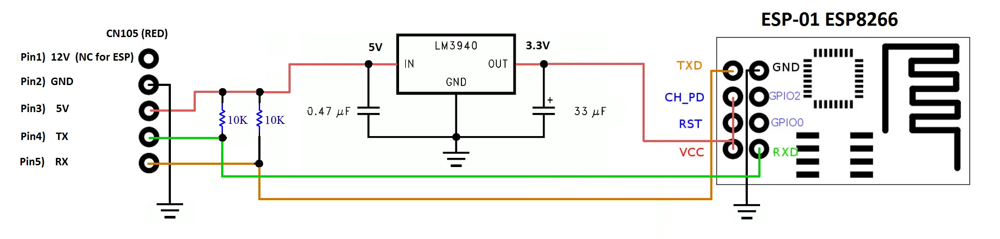

# GootAC - Native Apple HomeKit Controller for Mitsubishi Air Conditioners

GootAC is a firmware for the ESP8266 (built for the Wemos D1 Mini v4 that I personally use for my mini splits) that provides native Apple HomeKit integration for Mitsubishi air conditioning units. It interfaces directly with the unit via the 5-pin CN105 serial port and presents a homekit native HeaterCooler and Dehumidifier service.

---

## Key Features

- **Native HomeKit Integration**: Pair directly with the Apple Home app for seamless ecosystem control.
- **Multifunction Interface**:
    - **HeaterCooler Service**: Primary control for Heating, Cooling, and Smart Auto modes. Includes integrated Fan Speed, Swing Mode, and Target Temperature offsets.
    - **Dehumidifier Service**: Dedicated toggle for the unit's Dry (Dehumidify) mode.
- **Embedded Diagnostics**: Flash-persistent system logs stored on-device and served via HTTP.
- **OTA Updates**: Wireless firmware deployment via ArduinoOTA.

---

## Hardware Configuration

### Wiring and Interfacing

The ESP8266 connects directly to the 5-pin CN105 port on the Mitsubishi indoor unit's PCB. For the Wemos D1 Mini, use the hardware UART0 (RX/TX pins) to communicate with the unit.



> [!NOTE]
> Some sources (like the above image, from Swicago's HeatPump library) suggest using a level shifter, but it is unnecessary for the Wemos D1 mini at least, in my experience.

#### CN105 Pinout
The pins are numbered 1 to 5 from the 12V supply pin:
1.  **12V**: Not Connected (NC)
2.  **GND**: Ground (Connect to ESP8266 GND)
3.  **5V**: Power (Connect to ESP8266 5V/VCC)
4.  **TX**: Transmit (Connect to ESP8266 RX - Note: hardware UART0 mapping)
5.  **RX**: Receive (Connect to ESP8266 TX - Note: hardware UART0 mapping)

---

## Initial Setup

### 1. Configuration
Initialize your build environment by copying the template:

```bash
cp src/config.h.example src/config.h
```

Modify `src/config.h` with your WiFi credentials and accessory naming.

### 2. Manual Deployment
This project uses [PlatformIO Core](https://docs.platformio.org/).

```bash
# Upload via Serial (Initial Flash)
pio run -t upload

# Upload via Over-the-Air
pio run -t upload --upload-port <DEVICE_IP_ADDRESS>
```

### 3. HomeKit Pairing
1.  Open the Home App.
2.  Select **Add Accessory** > **More options...**
3.  Select **GootAC** from discovered devices.
4.  Enter the setup code: `111-22-333`

---

## Management Utility

The included `manage.py` utility handles routine administrative tasks, discovery, and automated updates.

### Commands

| Command | Description |
| :--- | :--- |
| `list` | Discover and display diagnostics for all GootAC units on the network and serial. |
| `update` | Automatically update firmware on specific or all outdated devices (OTA). |
| `install` | Perform a factory reset and initial serial installation for new devices. |
| `monitor` | Open the Serial Monitor for troubleshooting connected USB devices. |
| `debug-usb` | Display detailed hardware and port information for connected controllers. |

---

## Technical Specifications

Logs are stored on the internal SPIFFS/LittleFS storage to preserve history across reboots and network instability. They can be viewed directly via the web browser:
- `http://<DEVICE_IP>/log` - Current session logs.
- `http://<DEVICE_IP>/log.old` - Archived logs from previous boot.
- `http://<DEVICE_IP>/status` - Raw JSON hardware state.

---

## Licensing
Licensed under the GNU Lesser General Public License (LGPL).
Incorporates logic and components from:
- [Arduino-HomeKit-ESP8266](https://github.com/Mixiaoxiao/Arduino-HomeKit-ESP8266)
- [SwiCago's HeatPump Library)](https://github.com/SwiCago/HeatPump)
